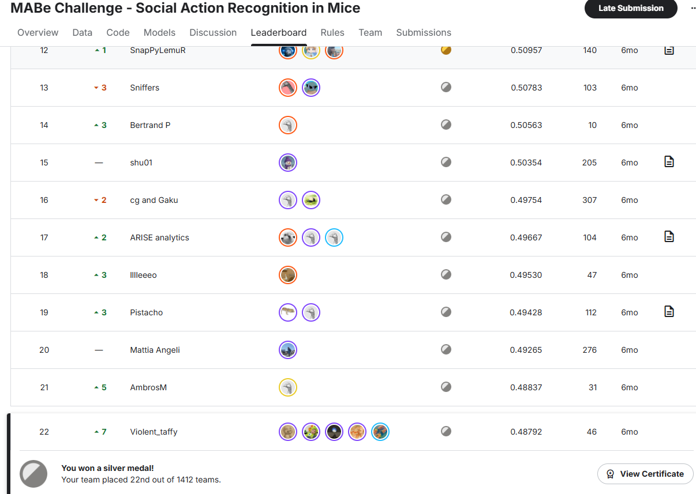

# MABe 挑战赛 — 小鼠社交行为识别

> 🏆 **1412 支队伍中排名第 22** | 前 2% | Kaggle 竞赛

[](https://www.kaggle.com/competitions/MABe-mouse-behavior-detection)
[](https://www.python.org/)
[](https://lightgbm.readthedocs.io/)
[](LICENSE)

## 📋 竞赛简介

[MABe（Mouse Action Behavior）挑战赛](https://www.kaggle.com/competitions/MABe-mouse-behavior-detection) 是一个 Kaggle 竞赛，专注于从多动物姿态估计跟踪数据中自动识别小鼠的社交行为。给定关键点轨迹（鼻子、耳朵、身体中心、尾根等），目标是预测每对互动小鼠的行为起止帧和动作类型。

### 需要识别的行为（多标签时序分割）

| 类型 | 行为 |
|------|------|
| **单鼠行为** | 站立（rear）、理毛（groom）、舔舐（lick）、嗅探（sniff）等 |
| **双鼠社交行为** | 追逐（chase）、逃跑（flee）、攻击（attack）、骑跨（mount）、探查（investigate）、嗅脸/身体/生殖器等 |

<p align="center">
  
</p>

## 🧠 方法论

### 模型流程

```
原始跟踪数据 (parquet)
    ↓ 按 mouse_id × bodypart 透视
    ↓ 坐标归一化（转为厘米单位）
    ↓ 缺失值短间隙填充
    ↓
┌─ 单鼠特征 ────────────┐   ┌─ 双鼠交互特征 ──────────┐
│ • 身体部位间距离       │   │ • 跨身体部位距离矩阵    │
│ • 运动特征（速/加/曲） │   │ • 追逐/逃跑/侧移指标   │
│ • 姿态与朝向           │   │ • 相对轨迹特征          │
│ • 场地空间上下文       │   │ • 接触语义特征          │
│ • 高频微运动           │   │ • 领导-跟随动态         │
│ • 体轴分解             │   │ • 身体重叠检测          │
│ • 缺失即信号           │   │ • 速度/角度相似度       │
└───────────────────────┘   └───────────────────────────┘
    ↓
元数据特征（帧率、场地形状、小鼠数量、实验室ID...）
    ↓
LightGBM 二分类器 × 每类行为
    ↓ StratifiedGroupKFold（5折，按 video_id 分组）
    ↓ Optuna 逐行为阈值调优
    ↓ predict_multiclass → 合并连续帧 → 提交文件
```

### 核心技术

- **帧率自适应窗口**：所有时间窗口根据实际视频帧率缩放
- **缺失即信号**：关键点遮挡模式暗示攻击/社交行为
- **代理身体部位**：某部位缺失时自动降级使用替代部位（nose→head→耳朵中点）
- **体轴分解**：将速度分解为沿身体朝向的前向/侧向分量
- **接触语义**：多阈值前端锚点距离检测物理交互
- **圆形 & 矩形场地**：场地几何感知的空间特征

## 📂 项目结构

```
MABe-Challenge---Social-Action-Recognition-in-Mice/
├── MabeTrain.py          # 主训练与推理流程（约 3200 行）
├── requirements.txt      # Python 依赖
├── README.md             # 英文说明
├── README_CN.md          # 中文说明（本文件）
├── RANK.png              # 竞赛排名截图
└── .gitignore
```

## 🚀 使用方法

### 1. 安装依赖

```bash
pip install -r requirements.txt
```

### 2. 配置

编辑 `MabeTrain.py` 中的 `CFG` 类：

```python
class CFG:
    # 数据路径（Kaggle 环境）
    train_path = "/kaggle/input/MABe-mouse-behavior-detection/train.csv"
    test_path = "/kaggle/input/MABe-mouse-behavior-detection/test.csv"
    train_annotation_path = "/kaggle/input/MABe-mouse-behavior-detection/train_annotation"
    train_tracking_path = "/kaggle/input/MABe-mouse-behavior-detection/train_tracking"
    test_tracking_path = "/kaggle/input/MABe-mouse-behavior-detection/test_tracking"

    # 运行模式
    mode = "validate"   # "validate"=交叉验证评估, "submit"=测试集预测
    n_splits = 5
```

### 3. 运行训练 / 验证

```bash
python MabeTrain.py
```

- **`mode = "validate"`**：在训练集上执行 5 折交叉验证，输出每类行为的 F1 分数并保存模型/阈值。
- **`mode = "submit"`**：加载预训练模型，对测试集预测并生成 `submission.csv`。

### 4. 在 Kaggle Notebook 中运行

本代码设计在 Kaggle 环境中运行。复现步骤：
1. 创建启用 GPU 的 Kaggle Notebook
2. 添加 [MABe 竞赛数据集](https://www.kaggle.com/competitions/MABe-mouse-behavior-detection/data)
3. 复制 `MabeTrain.py` 并运行

## 📊 成绩

| 指标 | 分数 |
|------|------|
| **竞赛指标** | 基于 F1 的自定义多标签时序分割评分 |
| **排名** | 22 / 1412（前 1.6%） |
| **平均二分类 F1（CV）** | ~0.XX（因 section/action 而异） |

## 🛠 依赖项

- **Python 3.8+**
- **LightGBM** — 梯度提升分类器
- **scikit-learn** — 交叉验证、评估指标
- **Optuna** — 超参数/阈值优化
- **pandas / polars** — 数据处理
- **numpy** — 数值计算
- **joblib** — 模型序列化与并行处理
- **koolbox** — 自定义训练工具（Kaggle 专用）
- **tqdm** — 进度条

## 📝 协议

本项目基于 MIT 协议开源。详见 [LICENSE](LICENSE)。

## 🙏 致谢

- [MABe 挑战赛](https://www.kaggle.com/competitions/MABe-mouse-behavior-detection) 组织者和数据集提供方
- Kaggle 社区的宝贵讨论和见解
- 所有参赛队伍共同推动动物行为识别技术的进步
